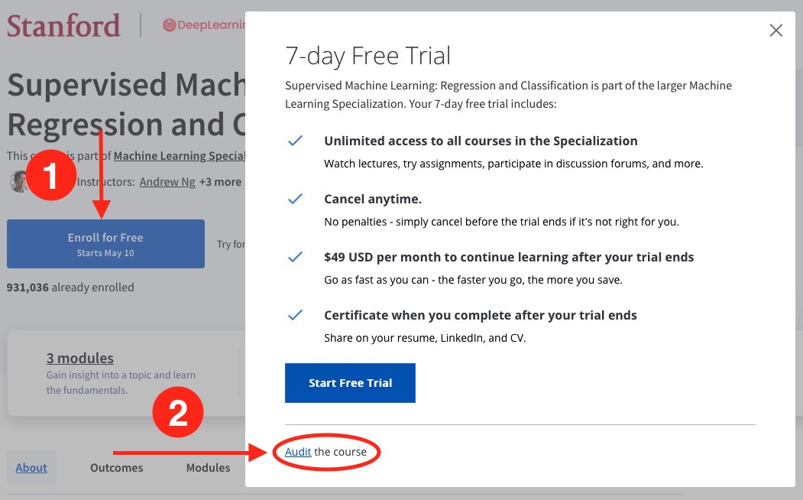
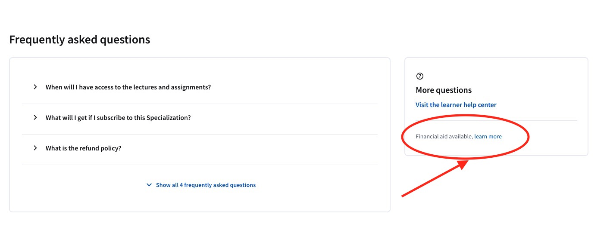

 

إليك ثلاث طرق رئيسية للالتحاق بدورات Coursera مجانًا:

1. **التسجيل في الدورة بدون شهادة (Audit the Course):** عند اختيار دورة على Coursera، يمكنك اختيار خيار “Audit”. هذا الخيار يتيح لك الوصول إلى المحتوى التعليمي، مثل محاضرات الفيديو والمواد الدراسية، دون دفع تكلفة. لن تتمكن من تقديم الواجبات والحصول على شهادة عند إتمام الدورة، ولكنك ستستفيد من المعلومات المقدمة بشكل كامل.

2. **التقديم لمنحة مالية:** توفر Coursera إمكانية التقديم على مساعدات مالية لمعظم الدورات. يمكنك التقديم بطلب للحصول على مساعدة مالية من خلال صفحة الدورة، حيث ستحتاج إلى ملء نموذج يوضح سبب حاجتك لهذه المساعدة. إذا تمت الموافقة على طلبك، ستحصل على وصول مجاني لجميع مكونات الدورة، بما في ذلك الشهادة عند إتمامها بنجاح. تجد هذا الخيار أسفل صفحة الدورة.

3. **للسوريين، التقديم على منحة تجمع الشباب السوري الرائعة للوصول إلى دروس كورسيرا بشكل كامل ومجاني:** [الخدمات التعليمية - أكاديمية تجمع الشباب السوري](https://academy.syrian-youth.org/educational-services/)

> في الغالب، تتوفر منح مشابهة تقدمها منظمات وجهات مختلفة في بلدان متعددة. يمكنكم البحث للتحقق من توفرها، ونرحب بتواصلكم لإضافتها إلى القائمة.
