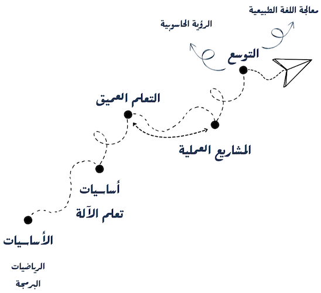

## مقدِّمة

نقدم هذا الدليل المبسط للبدء بتعلُّم أساسيات الذكاء الصنعي، مُركزًا بشكل خاص على التعلُّم العميق. لا يُعدُّ هذا الدليل شاملًا، بل ليتيح لك الانطلاقة التي تحتاجها. حيث يتطور هذا العلم بوتيرة سريعة، ونشهد أبحاثًا متجدِّدة تفتح آفاقًا جديدة.

نسعى لتحديث هذا الدليل باستمرار. ونحرص على اقتراح محتوى موثوق إما تم اختباره والتحقق من جودته عن طريقنا أو طريق أحد الأصدقاء، أو تم التحقق منه بفحص مراجعات وتقييمات وتوصيات المستخدمين والخبراء، لضمان تحقيق الفائدة المرجوة.

> [!TIP]  
> ركَّزنا على المنصات والجهات الموثوقة مثل: [كورسيرا](https://www.coursera.org/)، و[يوداسيتي](https://www.udacity.com/)، و[مقررات جامعة ستانفورد](https://www.youtube.com/@stanfordonline)، و[freeCodeCamp.org](https://www.freecodecamp.org/).

> [!IMPORTANT] **دعوة للمساهمة**
ندعوك للانضمام إلينا في تحسين هذا الدليل باستمرار. يمكنك تقديم مقترحاتك للتعديل أو التحسين عبر منصة [غيت هب](https://github.com/eefahd/public-docs-and-guides).
يُطلب من راغبي إضافة أو تعديل المحتوى أن يكونوا قد تحققوا بأنفسهم من وثوقية وفعالية المواد المقترحة وفائدتها للآخرين. في ظل كثرة المحتوى المتوفر عبر الإنترنت، نحرص على اقتراح ما ثبتت فعاليته عمليًا، خاصة للمبتدئين.

حاولنا أن يكون الاقتراح الافتراضي مبسَّطًا ومتوسِّطًا، لا مفصَّلًا ولا مفرط الإيجاز. مع خيارات إضافية في بعض الأحيان:
> [!WARNING] **للمتعجِّلين**
 > يحوي مقترحًا للراغبين في الإسراع بالتعلُّم.

> [!NOTE] **للصابرين**
> يحوي مقترحًا أكثر استرسالًا في التفاصيل.
  
## الأساسيات

### الأساسيات الرياضية

يُوصى بتحصيل بعض المبادئ الرياضية الأساسية لتكون قادرًا على فهم آلية التعلُّم العميق:
- **الجبر الخطي**: خاصة فهم المصفوفات وعملياتها، والأشعة.
- **التفاضل والتكامل**: خاصة المفاهيم الأساسية للتفاضل والتفاضل الجزئي والتكامل.
- **الاحتمالات والإحصاء**: خاصة طرق تحديد القيم المثلى.

 

**التوصية**
- [Mathematics for Machine Learning and Data Science \| Coursera](https://www.coursera.org/specializations/mathematics-for-machine-learning-and-data-science#courses)

> [!WARNING] **للمتعجِّلين**
> التركيز على العمليات الأساسية على المصفوفات مثل الجمع والضرب، وفهم مبادئ الاشتقاق البسيطة.

### الأساسيات البرمجية

#### لغة البرمجة بايثون
البراعة في البرمجة تُعد ركيزة أساسية في هذا المجال. لذلك، يجب بناء قاعدة قوية من المعرفة البرمجية مع الحرص على تطوير المهارات بشكل تدريجي ومستمر.

 

**التوصية**

- الأساسيات العامة:
  - [Learn Python - Full Course for Beginners \[Tutorial\] - YouTube](https://www.youtube.com/watch?v=rfscVS0vtbw)

- المكتبات الأساسية: Numpy, Pandas, Matplotlib:
  - [Data Analysis with Python - Full Course for Beginners (Numpy, Pandas, Matplotlib, Seaborn) - YouTube](https://www.youtube.com/watch?v=r-uOLxNrNk8)
  - [Python NumPy Tutorial for Beginners - YouTube](https://www.youtube.com/watch?v=QUT1VHiLmmI)

## المفاهيم الأساسية لتعلُّم الآلة

رغم التركيز على التعلُّم العميق، من المهم فهم الأساسيات في تعلُّم الآلة كونها تشكل بنية تحتية لهذا المجال. الموضوعات تشمل:

- التعلُّم الموجَّه: مثل Linear regression, Logistic regression, Decision trees.
- التعلُّم غير الموجَّه: مثل K-means وHierarchical clustering.
- مؤشرات قياس الأداء:  مثلAccuracy, Precision, Recall, F1-score, ROC-AUC.

 

**التوصية**

مقدمة لطيفة لتكوين فكرة أولية عامّة عمّا ستتعلم:
- [A Friendly Introduction to Machine Learning - YouTube](https://www.youtube.com/watch?v=IpGxLWOIZy4)
- [Machine Learning: Testing and Error Metrics - YouTube](https://www.youtube.com/watch?v=aDW44NPhNw0)

ثم الانتقال للدورة:
- [Machine Learning \| Coursera](https://www.coursera.org/specializations/machine-learning-introduction)

> [!WARNING] **للمتعجِّلين**
>فكرة عامة عن تعلُّم الآلة وكيفية تقييم الأداء يمكن متابعتها من خلال المساق الأول من الدورة المقترحة:
> - [Supervised Machine Learning: Regression and Classification \| Coursera](https://www.coursera.org/learn/machine-learning?specialization=machine-learning-introduction)

## التعلُّم العميق

هذا القسم هو الأكثر أهمية ويحتاج إلى التزام وصبر. لذلك اصبر وثابر وستتضّح الأمور تباعًا. لا تقلق إذا كانت بعض المفاهيم صعبة في البداية، فهذا طبيعي. بعد الانتهاء من التدريب، حاول القيام بمشاريع عملية لتفهم الأمور بشكل أفضل وترسخ ما تعلمته. قد تجد الفائدة في إعادة التدريب لاحقًا، حيث ستجد أن الأمور تصبح أوضح مع كل مرة. لذلك الصبر هو المفتاح. استعن بالله ولا تعجز.

مقدمة لطيفة لتكوين فكرة أولية عامة عمّا ستتعلم:
- [But what is a neural network? \| Deep learning chapter 1 - YouTube](https://www.youtube.com/watch?v=aircAruvnKk)
- [What is Deep Learning? \| Introduction to Deep Learning \| Deep Learning Tutorial \| Simplilearn - YouTube](https://www.youtube.com/watch?v=FbxTVRfQFuI)
- [A friendly introduction to Deep Learning and Neural Networks - YouTube](https://www.youtube.com/watch?v=BR9h47Jtqyw&list=PLs8w1Cdi-zvavXlPXEAsWIh4Cgh83pZPO&index=1)

 

**التوصية**
- [Deep Learning \| Coursera](https://www.coursera.org/specializations/deep-learning)

> تنويه: يجد البعض مللًا في حضور هذا التدريب، لكنه -على الرغم من قدمه- يُعتبر من أفضل التدريبات إن لم يكن أفضلها. فهو يقدم معلومات مبنية على أساس علمي مع توضيحها. لذلك ننصح به.

> [!WARNING] **للمتعجِّلين**
> لا تعجُّل هنا!

> [!NOTE] **للصابرين**
> تعتبر محاضرات جامعة ستانفورد مصدرًا غنيًا بالمعلومات. أنصح بمتابعتهم بعد تنفيذكم لعدد من المشاريع العملية، لتكون بنية أساسية وعدم الاكتفاء بغزارة المعلومات دون تثبيتها. فيما يلي محاضرات مواد شهيرة:
> - التعلُّم العميق:
>   - [CS231n Winter 2016 - YouTube](https://www.youtube.com/playlist?list=PLkt2uSq6rBVctENoVBg1TpCC7OQi31AlC)
>   - [Stanford CS230: Deep Learning \| Autumn 2018 - YouTube](https://www.youtube.com/playlist?list=PLoROMvodv4rOABXSygHTsbvUz4G_YQhOb)
>
> - معالجة اللغة الطبيعية بالتعلُّم العميق:
>   - [Stanford CS224N: Natural Language Processing with Deep Learning \| 2023 - YouTube](https://www.youtube.com/playlist?list=PLoROMvodv4rMFqRtEuo6SGjY4XbRIVRd4)

 

**كتب مجانية:**
- [The Little Book of Deep Learning](https://fleuret.org/francois/lbdl.html)
- [Deep Learning](https://www.deeplearningbook.org/)
- [Dive into Deep Learning — Dive into Deep Learning 1.0.3 documentation](https://d2l.ai/index.html)
## المشاريع العملية

في هذه المرحلة، من المهم تنفيذ مشاريع عملية قدر المستطاع لترسيخ الأفكار المكتسبة. قد تواجه صعوبة في البداية، حتى في أصغر الأمور المبكرة مثل تجهيز البيانات للتدريب. هذا طبيعي، مع الممارسة، ستُصبح هذه المهام أسهل، ويرافقها البدء بفهم بعض الأمور النظرية حيث قد تراجع فكرة معينة خلال التطبيق العملي أو خلال قراءتك لأكواد الآخرين. هذه الخطوة ضرورية ولا غنى عنها لفهم أعمق.

>حاول إيجاد فكرة مشروع خاص بك وابدأ بتنفيذها بما يناسب معرفتك الحالية. اجعل مشروعك بسيطًا ليكون بداية جيدة للانطلاق.

قبل أو خلال القيام بالمشاريع العملية يجب اعتبار التالي:
### تعلُّم أحد المكتبات الشائعة في التعلُّم العميق
في هذه المرحلة، ركِّز على مكتبة واحدة مثل PyTorch أو TensorFlow واصقل مهاراتك بها. شخصيًا، أُوصي بمكتبة PyTorch لسهولة استخدامها وشيوعها المتزايد في مجالات البحث الحديثة.

 

**التوصية**
- [PyTorch Tutorial 01 - Installation - YouTube](https://www.youtube.com/watch?v=EMXfZB8FVUA&list=PLqnslRFeH2UrcDBWF5mfPGpqQDSta6VK4)

> [!NOTE] **للصابرين**
> - [PyTorch for Deep Learning & Machine Learning – Full Course - YouTube](https://www.youtube.com/watch?v=V_xro1bcAuA)

## ماذا بعد

إذا وصلت إلى هنا، فهذا يعني أنك طوَّرت مستوى جيدًا من الثقة والفهم لما تعلمّته. إذا شعرت بعدم الاطمئنان الكامل لفهمك أو مهاراتك، يُفضَّل العودة إلى الأساسيات والمشاريع العملية قبل المضي قدمًا.

إن كنت مستعدًا للمزيد، فغالبًا أنت الآن قادر على التوسع بشكل ذاتي وتحديد المجالات التي ترغب التعمق فيها. (غير صحيح؟ راسلنا)

الكثير يختارون بين الرؤية الحاسوبية (Computer Vision) ومعالجة اللغة الطبيعية (NLP)، وهو قرار شخصي يعتمد على ميولك واهتماماتك الشخصية. اختر المجال الذي تُحب واستكشِفه بعمق. مع مرور الوقت، سَتُمكّن من متابعة المستجدات. قد تبدأ أيضًا بقراءة الأوراق العلمية الجديدة لفهم الطرق والأساليب المبتكرة.

> أُعد هذا الدليل ليكون نقطة بداية للمبتدئين، لذلك لن نغطي جميع المواضيع المختلفة هنا. بمجرد أن تكتسب الأساسيات الصلبة، ستكون جاهزًا لاستكشاف الأبعاد المختلفة للتعلُّم العميق بشكل ذاتي.

## ماذا عن العمل؟

بعد التعلم وتنفيذ المشاريع التدريبية، قد تسعى لتطبيق معارفك في المجال العملي. فقد تتساءل كيف يمكن الاستفادة من هذه المهارات في البيئات التجارية، وكيف يُمكن نشر المشاريع كخدمات حقيقية، وما هي المهارات التي تحتاجها في سوق العمل.

سنحاول الاستفاضة أكثر لاحقًا حول موضوع العمل الوظيفي في هذا المجال، لكن حاليًّا سنركز على بعض المهارات الشائعة لمهندسي تعلم الآلة:

- **المهارات البرمجية:** احرص على تطويرها باستمرار فهي أساسية للغاية.

- **نشر نماذج الذكاء الصنعي:** يُعدُّ نشر النموذج في بيئة عملية خطوة ضرورية. اطلع على كيفية إنشاء API باستخدام Flask أو FastAPI، أو إعداد Docker Image. كما ينبغي لك الاطلاع على طرق تجهيز النموذج قبل نشره مثل طرق الضغط والتحويل لصيغ أخرى.

- **بناء مسارات تعلم الآلة (ML pipelines).**

- **الاطلاع على الخدمات السحابية** المقدمة من الشركات الشهيرة خاصة بما يتعلق بخدمات تعلم الآلة، مثل SageMaker من AWS، أو الخدمات الأخرى التي تقدمها Google Cloud أو Microsoft Azure أو غيرهم من الشركات الشهيرة.